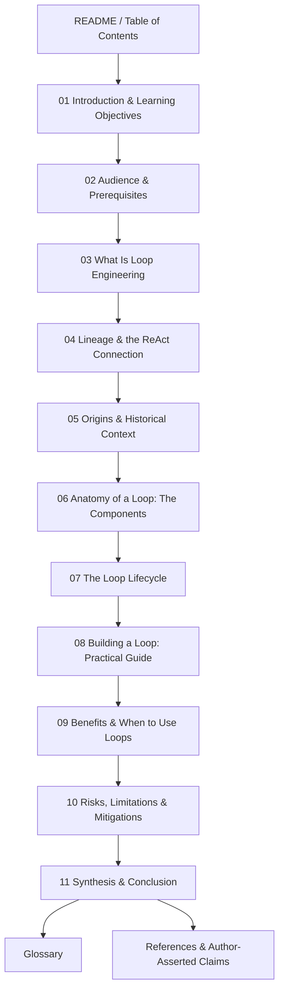

# Design Document

## Overview

This document describes the design of **Loop Engineering**, an educational book
authored as a collection of Markdown files. The deliverable is a content/learning
artifact, not software, so this design describes the *information architecture* of
the book rather than a software architecture: the chapter breakdown and ordering,
the file layout in the repository, the structural and formatting conventions every
chapter follows, the traceability between requirements and chapters, the approach
to worked examples, and the mechanism for flagging and collecting Author-Asserted
Claims.

The book teaches Loop Engineering — the practice of designing a control system
that prompts, observes, verifies, and iterates AI coding agents autonomously,
rather than prompting them manually turn-by-turn. It is pitched at software
engineers who already use AI coding agents at a user level but have not yet built
systems to orchestrate them.

### Authoring Environment Constraint

Live internet access and web-search tooling are **not available** in this authoring
environment. The design therefore relies on the source material supplied by the
user plus general background knowledge. Every dated event, named attribution, or
direct quote is treated as an **Author-Asserted Claim**: it is written into the
prose, marked inline as independently verifiable, and collected in a dedicated
references chapter. This design bakes that flagging mechanism into the structural
conventions (see *Author-Asserted Claim Convention*) so that source integrity is a
structural property of the book, not an afterthought.

### Design Goals

1. **Pedagogical ordering** — foundational and conceptual material precedes
   practical, build-oriented material so a reader can progress linearly.
2. **Self-contained navigability** — a table of contents plus per-chapter
   prev/next links let the reader read linearly or jump to topics.
3. **Traceability** — every requirement and every learning objective maps to a
   specific chapter, so coverage is verifiable.
4. **Source transparency** — every author-asserted fact is flagged inline and
   collected centrally, so the reader always knows what to verify independently.
5. **Consistency** — a single glossary is the source of truth for terminology, and
   all chapters use defined terms consistently.

## Architecture

### Information Architecture

The book is organized as a linear sequence of chapters that moves the reader along
a deliberate learning arc:

```
Foundations  ->  History & Anatomy  ->  Flow  ->  Practice  ->  Judgment & Synthesis
  (why/what)        (the parts)       (how parts    (build it)    (when/risks/wrap-up)
                                       interact)
```

This arc maps to the requirements as follows: foundational chapters satisfy
Requirements 1–4 (objectives, audience, conceptual foundation, history); the
anatomy and flow chapters satisfy Requirements 5–6 (components and lifecycle); the
practice chapter satisfies Requirement 7 (hands-on building); and the closing
chapters satisfy Requirements 8–9 (benefits, risks, synthesis). Structure and
quality requirements (10–11) are cross-cutting and realized through the conventions
and supporting files described below.

### Chapter Breakdown and Ordering

The reading order is fixed and encoded both in the table of contents and in the
prev/next links of each chapter.



| # | Chapter | Purpose | Primary Requirements |
|---|---------|---------|----------------------|
| 01 | Introduction & Learning Objectives | State what the book teaches and the explicit learning objectives | 1.1, 1.2, 1.3 |
| 02 | Audience & Prerequisites | Identify the reader and assumed background | 2.1, 2.2, 2.3 |
| 03 | What Is Loop Engineering | Define the discipline; contrast with manual prompting | 1.3, 3.1 |
| 04 | Lineage & the ReAct Connection | Evolution from prompt → context → harness → loop; ReAct relationship | 3.2, 3.3, 3.4 |
| 05 | Origins & Historical Context | Term popularization, named perspectives, Ralph Loop history | 4.1, 4.2, 4.3, 4.4 |
| 06 | Anatomy of a Loop: The Components | Deep dive on each of the eight components | 5.1–5.9 |
| 07 | The Loop Lifecycle | End-to-end ordered flow and the continue/spawn/stop decision | 6.1, 6.2, 6.3 |
| 08 | Building a Loop: Practical Guide | Minimal and production-grade worked examples; patterns | 7.1–7.6 |
| 09 | Benefits & When to Use Loops | Motivation and suitable categories of work | 8.1, 8.2 |
| 10 | Risks, Limitations & Mitigations | Cost, slop, judgment, honest treatment | 9.1, 9.2, 9.3 |
| 11 | Synthesis & Conclusion | Concluding framing of Loop Engineering | 9.4 |
| — | Glossary | Single source of truth for terminology | 10.6, 11.1 |
| — | References | Collected Author-Asserted Claims with verification note | 11.2, 11.3, 11.5 |

Note that some chapters intentionally reinforce the same requirement (e.g., 1.3 is
introduced in Chapter 01 and fully delivered across Chapters 03–06). The
traceability matrix in Chapter 11 / References records the *primary* owning chapter
for each acceptance criterion.

### File Layout

All book content lives under a `book/` directory inside the project repository so
that the deliverable is cleanly separated from spec files. File names are
zero-padded and ordered to match reading order.

```
what-is-loop-engineering/
  README.md                      # repo landing page; links into book/
  book/
    README.md                    # Table of Contents (reading order + links)
    01-introduction.md
    02-audience-and-prerequisites.md
    03-what-is-loop-engineering.md
    04-lineage-and-react.md
    05-origins-and-history.md
    06-anatomy-of-a-loop.md
    07-loop-lifecycle.md
    08-building-a-loop.md
    09-benefits.md
    10-risks-and-mitigations.md
    11-synthesis-and-conclusion.md
    glossary.md
    references.md
```

The book's `book/README.md` serves as the table of contents (Requirement 10.2).
The repository `README.md` is updated with a short description and a link into
`book/README.md` so a visitor lands somewhere useful.

## Components and Interfaces

In a content artifact, the "components" are the reusable structural conventions
that every chapter and supporting file must implement. These conventions are the
contract that makes the cross-cutting requirements (structure, navigation, source
integrity, consistency) verifiable.

### Chapter Template

Every chapter file follows the same skeleton:

```markdown
# <NN. Chapter Title>            <!-- exactly one H1 per chapter (Req 10.4) -->

> **In this chapter:** <1–3 sentence statement of what the reader will learn>   <!-- Req 1.4 -->

## <Section heading>             <!-- H2 for sections, H3+ for sub-sections -->
...prose...

## Key Takeaways                 <!-- Req 1.5 -->
- bullet summary of the chapter's main points

---
<!-- Navigation footer (Req 10.5) -->
[< Previous: <prev title>](<prev-file>.md) | [Table of Contents](README.md) | [Next: <next title> >](<next-file>.md)
```

- The opening **"In this chapter"** callout satisfies the per-chapter intro
  requirement (1.4).
- The closing **"Key Takeaways"** section satisfies the per-chapter summary
  requirement (1.5).
- The **navigation footer** satisfies prev/next navigation (10.5). The first
  chapter omits a Previous link; the last content chapter's Next points to the
  Glossary.

### Heading-Level Convention

- Exactly one H1 (`#`) per file — the chapter title (Requirement 10.4).
- H2 (`##`) for major sections, H3 (`###`) and deeper for nested sub-sections.
- No heading level is skipped (an H3 never appears without an enclosing H2).

### Author-Asserted Claim Convention

This is the central mechanism for source integrity (Requirements 4.4, 11.2, 11.3,
11.5). Two coordinated parts:

1. **Inline flag.** Wherever the prose states a dated event, a named attribution,
   or a direct quote, the sentence is immediately followed by an inline marker:

   ```markdown
   ... attributed to Addy Osmani's June 7, 2026 post. [^aac-osmani-2026]
   ```

   The book uses Markdown footnote-style reference markers of the form
   `[^aac-<slug>]`, and a short parenthetical phrase such as
   *"(Author-Asserted; verify independently)"* on first use in a chapter so the
   convention is obvious even where footnotes are not rendered.

2. **Central collection.** `references.md` lists every `[^aac-...]` claim with its
   attribution and an explicit note that the reader should verify it
   independently, because these facts could not be checked against live sources in
   the authoring environment.

A claim qualifies as Author-Asserted when it asserts a specific date, names a
specific person as the source of an idea or quote, or reproduces a quotation —
i.e., anything that is not established general background knowledge.

### Worked Example Convention

Worked examples (Requirement 7) follow a fixed presentation contract:

- Code or configuration appears in a fenced code block **with a language hint**
  (e.g., ```` ```bash ````, ```` ```python ````, ```` ```yaml ````) — Requirement 7.4.
- Each significant part of the example is annotated, either with inline comments
  inside the block or with prose immediately after the block explaining what each
  part does — Requirement 7.5.

Two worked examples are designed (detailed in *Data Models → Worked Example
Designs*): a **minimal Ralph-style bash loop** and a **production-grade loop**.

### Glossary Interface

`glossary.md` is the single source of truth for terminology (Requirements 10.6,
11.1). It mirrors the glossary already established in the requirements document.
Each entry is a term plus a one-to-three sentence definition. Chapters use these
terms consistently with their glossary meaning and link to the glossary on first
substantive use where helpful.

### Table of Contents Interface

`book/README.md` lists all chapters in reading order as a linked list, followed by
links to the Glossary and References. It is the canonical entry point and the
authority on reading order; the chapter prev/next links must agree with it.

## Data Models

Although this is prose, several recurring structured artifacts behave like data
models. Defining them up front keeps the content consistent.

### Learning Objective

A short, outcome-oriented statement of what the reader will be able to do. Each
objective is owned by Chapter 01 and traced to the chapter(s) that deliver it.

| Field | Description |
|-------|-------------|
| Statement | "After this book you will be able to …" outcome phrasing |
| Delivered by | Chapter number(s) that fulfill the objective |

Planned objectives (each must be covered by ≥1 chapter, Requirement 1.2):

1. Explain what a Loop is and how it differs from manual prompting. (Ch 03)
2. Place Loop Engineering in its lineage and relate it to ReAct. (Ch 04)
3. Recount the origins of the term and the precursor Ralph Loop. (Ch 05)
4. Identify and explain the purpose of each Loop component. (Ch 06)
5. Trace the end-to-end Loop lifecycle and its decision points. (Ch 07)
6. Build a minimal Loop and evolve it toward a production-grade Loop. (Ch 08)
7. Judge when to apply Loops and weigh their benefits. (Ch 09)
8. Anticipate the risks of Loops and apply concrete mitigations. (Ch 10)

### Loop Component

The eight components dissected in Chapter 06. Each is documented with a purpose and
at least one concrete example (Requirement 5.9).

| Component | Purpose (summary) | Example(s) |
|-----------|-------------------|------------|
| Automation/Trigger | Decide when and how work enters the Loop | cron schedule, webhook on new issue, slash-style command |
| Worktrees/Isolation | Keep each agent run isolated and reversible | git worktrees, separate branches |
| Generator Agent | Produce the actual output (code/edits) | Claude Code, a Grok agent |
| Evaluator | Verify the generator's output | test suite, code-review/critic agent, rubric scorer |
| State/Memory | Persist progress across iterations | TODO file, scratchpad, project board, files on disk |
| Skills/Knowledge | Supply reusable guidance and standards | skills file, agents-guidance file, coding standards |
| Connectors | Integrate with external systems | source-control host, issue tracker, chat platform |
| Stopping Condition | Decide when the Loop terminates | tests pass, rubric threshold, max iterations/budget |

### Loop Lifecycle Stages

The ordered sequence presented in Chapter 07 (Requirement 6.1):

1. Discover or trigger work
2. Spawn agent(s) in an isolated workspace
3. Agent acts to produce output
4. Evaluator checks the output
5. If insufficient, feed feedback back and repeat
6. Persist state
7. Decide: continue, spawn a sub-agent, or stop

### Author-Asserted Claim Record

Each entry collected in `references.md`:

| Field | Description |
|-------|-------------|
| ID | `aac-<slug>` matching the inline `[^aac-<slug>]` marker |
| Claim | The asserted fact (date, attribution, or quote) |
| Attributed to | Named source from supplied material |
| Verification note | "Author-asserted; reader should verify independently" |

Planned records derived from the requirements:

- `aac-osmani-2026` — popularization of "Loop Engineering" attributed to Addy
  Osmani's June 7, 2026 post (Req 4.1).
- `aac-steinberger` — supporting perspective attributed to Peter Steinberger
  (Req 4.2).
- `aac-cherny` — supporting perspective attributed to Boris Cherny (Req 4.2).
- `aac-huntley-2025` — the Ralph Loop ("Ralph Wiggum technique") attributed to
  Geoffrey Huntley in 2025 (Req 4.3).

### Worked Example Designs

**Minimal Ralph-style bash loop (Requirement 7.2).** A small loop that repeatedly
feeds an agent fresh context plus the previous output/errors until a task is done.
Presented in a ```` ```bash ```` block with annotations explaining the loop
condition, the agent invocation, and how prior output is recycled into the next
iteration. It deliberately has *no* isolation, evaluator, or persisted state — it
exists to contrast with the production example.

**Production-grade loop (Requirement 7.3).** An evolution of the minimal example
that adds the four production concerns explicitly:

- **Isolation** — each iteration runs in a git worktree / separate branch.
- **Evaluator** — a separate verification step (test suite and/or critic) gates
  acceptance of the generator's output.
- **Persisted state** — a TODO/state file records progress between iterations.
- **Stopping conditions** — explicit termination on tests passing, a rubric
  threshold, or a max-iteration/budget cap.

Presented as annotated fenced blocks (bash plus a pseudocode/`yaml` config) with a
short narrative connecting it back to the components from Chapter 06 and the
lifecycle from Chapter 07.


## Correctness Properties

*A property is a characteristic or behavior that should hold true across all valid
executions of a system — essentially, a formal statement about what the system
should do. Properties serve as the bridge between human-readable specifications and
machine-verifiable correctness guarantees.*

Because this deliverable is a book rather than executable software, these
properties are **content-quality invariants**: statements that must hold across all
chapters and supporting files. Each is mechanically checkable by a lightweight
content-linting script that parses the Markdown files (see *Testing Strategy*),
rather than by a code-level property-based testing library. They were derived from
the prework analysis and consolidated to remove redundancy.

### Property 1: Learning-objective coverage

*For all* learning objectives listed in the introduction, there exists at least one
chapter that addresses that objective, and that chapter file is present in the
book.

**Validates: Requirements 1.2**

### Property 2: Chapter framing and heading structure

*For all* chapter files, the chapter begins with an "In this chapter" intro
statement before its first section, ends with a "Key Takeaways" summary section,
and contains exactly one top-level (H1) heading with no skipped heading levels.

**Validates: Requirements 1.4, 1.5, 10.4**

### Property 3: Loop-component documentation completeness

*For all* eight Loop components (Automation/Trigger, Worktrees/Isolation, Generator
Agent, Evaluator, State/Memory, Skills/Knowledge, Connectors, Stopping Condition),
the anatomy chapter contains a dedicated subsection that states the component's
purpose and gives at least one concrete example of its use.

**Validates: Requirements 5.1, 5.2, 5.3, 5.4, 5.5, 5.6, 5.7, 5.8, 5.9**

### Property 4: Navigation integrity

*For all* chapters in the book, the table of contents links to that chapter in
reading order, and each chapter (except the first and last endpoints) provides a
navigation footer with correct links to both the previous and next chapter
consistent with the table-of-contents order.

**Validates: Requirements 10.2, 10.5**

### Property 5: Terminology consistency with the glossary

*For all* terms defined in the glossary, the term is defined exactly once (in the
glossary) and is used throughout every chapter with that single, consistent meaning
— never redefined or contradicted elsewhere.

**Validates: Requirements 3.5, 11.1**

### Property 6: Author-Asserted Claim integrity

*For all* statements that assert a dated event, a named attribution, or a direct
quote, the statement carries an inline Author-Asserted marker (`[^aac-...]`) and
that marker resolves to a corresponding entry in the references file, where the
entry records the attribution and the note that the reader should verify it
independently. Conversely, every entry in the references file is referenced by at
least one inline marker.

**Validates: Requirements 4.1, 4.2, 4.3, 4.4, 11.2, 11.3, 11.5**

### Property 7: Worked-example formatting

*For all* worked examples containing code or configuration, every fenced code block
carries a language hint, and each worked example is accompanied by annotations
(inline comments or adjacent explanatory prose) describing what its significant
parts do.

**Validates: Requirements 7.4, 7.5**

## Error Handling

For a content artifact, "errors" are content defects — gaps, inconsistencies, and
broken structure. The strategy is to make defects detectable and to define a clear
response for each class.

| Defect class | Detection | Response |
|--------------|-----------|----------|
| Missing chapter / broken TOC link | TOC link points to a non-existent file | Create the missing chapter or fix the link before publishing |
| Broken prev/next navigation | Footer link target missing or out of order vs TOC | Correct the footer to match TOC order |
| Uncovered learning objective | Objective has no owning chapter | Add coverage to a chapter or remove the objective |
| Undocumented Loop component | A component lacks purpose or example | Add the missing purpose/example subsection |
| Unflagged dated/attributed claim | A date/name/quote without an `[^aac-...]` marker | Add inline marker and a references entry |
| Orphaned reference entry | A references entry with no inline marker | Remove the entry or add the inline citation |
| Terminology drift | A glossary term used with a conflicting meaning | Reword to match the glossary, or update the glossary |
| Missing language hint | A fenced block without a language tag | Add the correct language hint |
| Heading-level violation | Multiple H1s or a skipped level | Normalize headings to the convention |

Because the authoring environment has no live internet, a special category applies:
**unverifiable facts**. The response is never to silently drop or assert them as
established fact; instead they are downgraded to Author-Asserted Claims, flagged
inline, and collected in references (Requirement 11.5).

## Testing Strategy

The book is validated with a combination of an automated content-linting check and
human editorial review. Property-based testing in the traditional sense (a PBT
library generating random inputs) does not apply, because the artifact is static
prose, not a function over an input domain. Instead, the seven correctness
properties above are realized as deterministic checks over the fixed set of book
files.

### Automated Content Checks

A lightweight script (or a manual checklist run, if no script is desired) verifies
each correctness property against the Markdown files:

- **Property 1** — extract the objectives list from Chapter 01; confirm each maps
  to a present chapter file.
- **Property 2** — for each `book/NN-*.md`, confirm exactly one H1, an
  "In this chapter" intro, a "Key Takeaways" section, and no skipped heading
  levels.
- **Property 3** — in Chapter 06, confirm a subsection for each of the eight
  components, each with a purpose and at least one example.
- **Property 4** — parse `book/README.md` for chapter links in order; confirm each
  chapter's prev/next footer agrees with that order.
- **Property 5** — collect glossary terms; confirm each is defined once and scan
  chapters for contradictory redefinitions.
- **Property 6** — collect all `[^aac-...]` markers and all `references.md` entries;
  confirm a bijection and that each entry carries a verification note.
- **Property 7** — confirm every fenced block inside worked-example sections has a
  language hint and adjacent annotation.

### Editorial Review (example-based and qualitative checks)

Items that are not mechanically checkable are covered by editorial review against a
checklist derived from the example-classified acceptance criteria:

- Audience and prerequisites stated (2.1, 2.2); concepts defined before use (2.3).
- Definition and contrast with manual prompting present (3.1); lineage and ReAct
  relationship explained (3.2, 3.3, 3.4).
- Lifecycle ordered sequence, decision point, and a structured representation
  present (6.1, 6.2, 6.3).
- Practical guide with minimal and production-grade examples and patterns present
  (7.1, 7.2, 7.3, 7.6).
- Benefits, suitable work categories, risks, mitigations, judgment statement, and
  synthesis present (8.1, 8.2, 9.1, 9.2, 9.3, 9.4).
- Prose is clear and active-voice; acronyms (e.g., ReAct) defined at first use
  (11.4).

### Coverage Traceability

The References chapter includes a short traceability note mapping each requirement
to its owning chapter, so a reviewer can confirm full coverage at a glance. This
makes the relationship between requirements and content auditable and supports the
"every objective covered" and "every component documented" properties above.
