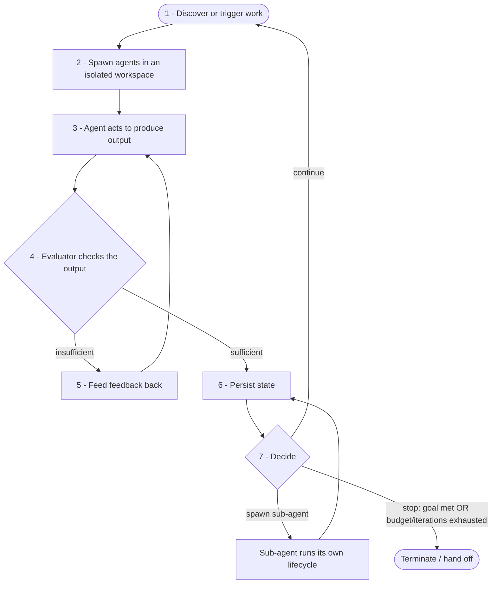

# 07. The Loop Lifecycle

> **In this chapter:** You will learn how the eight components from Chapter 06
> come alive as an ordered, repeating **lifecycle** — the seven stages a unit of
> work passes through as a Loop runs: discover or trigger work, spawn agents in
> an isolated workspace, act to produce output, evaluate that output, feed
> feedback back and repeat when it falls short, persist state, and then decide
> whether to continue, spawn a sub-agent, or stop. You will learn the criteria
> that drive that final three-way decision, and you will see the whole flow laid
> out as a diagram, a numbered sequence, and a fenced pseudocode block. By the
> end you will be able to trace a single piece of work from trigger to
> termination and explain what happens — and why — at every stage.

## From Parts to Motion

Chapter 06 opened the machine and named its eight parts. This chapter sets them
turning. A list of components tells you *what* a Loop is made of; the lifecycle
tells you *how those parts interact over time* — the order in which control
passes from one to the next, and what each one contributes on every pass around
the circle.

The lifecycle is the answer to a simple question: *what actually happens, step by
step, when a Loop runs?* In manual prompting you supply that sequence yourself —
you decide there is work, you ask the agent to do it, you read the result, you
judge whether it is good, you remember where you are, and you decide whether to
ask again. A Loop encodes exactly that sequence as a repeating cycle so it can run
without you in the chair. The stages below are those same judgments, made
explicit and ordered.

## The Seven Stages

A Loop moves work through **seven ordered stages.** Stages one through six form
the body of a single iteration; the seventh is the decision that closes the
iteration and chooses what happens next. Each stage is owned by one or more of the
components you met in Chapter 06, named in **bold** as we go.

### Stage 1 — Discover or trigger work

The cycle begins when work *enters* the Loop. Either the Loop discovers there is
something to do — the next unfinished item on a list — or an external event
triggers it. This is the job of the **Automation/Trigger** component: a cron
schedule that fires overnight, a webhook on a newly filed issue, or a
`/loop`-style command. Nothing happens until this stage starts the iteration, and
nothing here requires a human to type "go."

### Stage 2 — Spawn agent(s) in an isolated workspace

With work in hand, the Loop creates a clean, sealed-off place for that work to
happen and launches one or more agents into it. This stage draws on
**Worktrees/Isolation** — a git worktree and a dedicated branch — so that whatever
the agent does is contained and reversible. The agent that gets spawned is the
**Generator Agent**, and as it starts it is handed the project's
**Skills/Knowledge** (the coding standards and agent-guidance files) so it works
by your rules from its first action.

### Stage 3 — The agent acts to produce output

Inside its isolated workspace, the **Generator Agent** does the hands-on work:
reading the task, editing the codebase, producing a diff. Where it needs to reach
the outside world — reading code from a source-control host, pulling details from
an issue tracker — it does so through the **Connectors**. This stage is the only
one where new output is *created*; every other stage exists to start it, check it,
remember it, or decide what to do about it.

### Stage 4 — The Evaluator checks the output

The freshly produced output is now judged from the outside. The **Evaluator**
(critic/verifier) runs the test suite, reviews the diff, or scores the result
against a rubric, and returns a verdict: is this good enough, or not? This is the
stage that protects the Loop from confidently accepting wrong or low-quality work.
Crucially, the judge is *separate* from the worker — the Generator Agent does not
get to mark its own homework.

### Stage 5 — If insufficient, feed feedback back and repeat

If the Evaluator's verdict is "not good enough," the Loop does not throw the work
away — it *learns from the failure.* The concrete signal of what went wrong (the
failing test output, the reviewer's comments, the rubric's low-scoring notes) is
fed back to the **Generator Agent** as added context, and the cycle returns to
Stage 3 for another attempt. This feedback path is the heart of what makes a Loop
a *loop*: each rejected attempt makes the next attempt better-informed, rather than
repeating blindly. (This stage is conditional — when the output is sufficient, the
Loop skips straight ahead.)

### Stage 6 — Persist state

Whether the iteration succeeded or simply made partial progress, the Loop records
what happened *outside* any single agent's context, using the **State/Memory**
component: it updates the `TODO.md`, writes notes to a scratchpad, or moves a card
on a project board. This is what lets the next iteration build on this one instead
of starting from scratch — and it is what lets *you* read the current state of the
work at any time.

### Stage 7 — Decide: continue, spawn a sub-agent, or stop

With the iteration complete and its state saved, the Loop reaches its decision
point. Guided primarily by the **Stopping Condition**, it chooses one of three
paths: **continue** to another iteration, **spawn a sub-agent** to handle a
distinct piece of work, or **stop**. This three-way choice is important enough
that the next section is devoted entirely to it.

## The Decision Point: Continue, Spawn, or Stop

Every trip around the Loop ends at the same fork, and the path it takes is decided
by clear criteria rather than guesswork. The **Stopping Condition** is the primary
authority here, but the decision is genuinely three-way.

**Stop** — the Loop terminates when one of two kinds of rule fires:

- *Success.* The goal has been met: the Evaluator's tests pass, or the rubric
  score has reached its threshold. The work is done, so the Loop finishes
  deliberately and hands off its result (for example, by opening a pull request
  through a **Connector**).
- *Safety.* A guardrail has been hit: the maximum number of iterations is reached,
  or the token/cost budget is exhausted. Here the Loop stops *without* having
  succeeded and escalates to a human rather than spinning on. This is the rule
  that keeps a Loop from becoming a runaway process.

**Continue** — if neither a success nor a safety rule has fired, there is still
useful work to do and budget to do it with, so the Loop goes around again. In
practice "continue" is the path taken after Stage 5's feedback: the current task
is not finished, the attempt count and budget are within bounds, so the Loop
starts a fresh iteration on the same task with what it just learned.

**Spawn a sub-agent** — sometimes the right move is neither to retry the same task
nor to quit, but to *delegate.* When the work naturally splits into a distinct,
self-contained piece — a focused sub-task that is large enough to deserve its own
isolated workspace and its own evaluation — the Loop spawns a sub-agent to handle
it. The sub-agent runs its own miniature lifecycle (its own spawn, act, evaluate,
persist) and reports its result back to the parent Loop. The criteria that favor
spawning are *decomposability* (the task cleanly divides) and *independence* (the
piece can be worked on without constant coordination); choose it when a single
agent grinding linearly would be slower or messier than parcelling the work out.

In short: **stop** when you are done or out of budget, **spawn a sub-agent** when
the work should be divided and delegated, and **continue** when there is more to do
on the task at hand and the resources to keep going.

## The Lifecycle, Visualized

The same flow is shown three ways below — as a diagram, as a numbered sequence,
and as pseudocode — so you can read it whichever way is clearest to you.



As a numbered flow, the same lifecycle reads:

1. **Discover or trigger work** — the Automation/Trigger starts an iteration.
2. **Spawn agent(s) in an isolated workspace** — Worktrees/Isolation gives the
   Generator Agent a safe place to run, with Skills/Knowledge loaded.
3. **Agent acts to produce output** — the Generator Agent edits code, reaching out
   via Connectors as needed.
4. **Evaluator checks the output** — tests, review, or a rubric return a verdict.
5. **If insufficient, feed feedback back and repeat** — the failure signal is
   returned to the agent and control goes back to step 3.
6. **Persist state** — State/Memory records progress so the next iteration builds
   on this one.
7. **Decide: continue, spawn a sub-agent, or stop** — the Stopping Condition picks
   the path; *continue* returns to step 1, *spawn* delegates a sub-task, *stop*
   terminates on success or on a safety limit.

And expressed as pseudocode, the lifecycle is a loop with a feedback path nested
inside it:

```python
# The Loop lifecycle as a control loop. Stages are numbered to match the text.
def run_loop(goal, max_iterations, budget):
    state = load_state()                          # State/Memory persists across runs

    while True:
        task = discover_or_trigger_work(state)    # 1: Automation/Trigger
        if task is None:
            stop("no work left")                  # nothing to do -> terminate

        workspace = spawn_isolated_workspace(task)  # 2: Worktrees/Isolation
        agent = spawn_generator_agent(workspace, skills)  # 2: Generator + Skills

        feedback = None
        while True:
            output = agent.act(task, feedback)    # 3: Generator Agent produces output
            verdict = evaluator.check(output)     # 4: Evaluator judges from outside
            if verdict.is_sufficient:
                break                             # accepted -> leave the inner loop
            feedback = verdict.details            # 5: feed the failure signal back
            if over_budget(budget) or hit_iteration_cap(max_iterations):
                stop("safety limit reached -> escalate to a human")

        state = persist_state(state, task, output)  # 6: State/Memory

        decision = decide(state, goal, budget, max_iterations)  # 7: Stopping Condition
        if decision == "stop":
            stop("goal met" if goal_met(state) else "budget/iterations exhausted")
        elif decision == "spawn_sub_agent":
            subtask = next_decomposable_piece(state)
            run_loop(subtask, max_iterations, budget)  # sub-agent: its own lifecycle
        # otherwise: "continue" -> fall through and start the next iteration
```

The pseudocode makes two structural points visible. First, there are really *two*
loops: an **inner** loop (stages 3–5) where a single task is retried with feedback
until the Evaluator accepts it or a safety limit fires, and an **outer** loop
(stages 1–7) that moves from one unit of work to the next. Second, the
`decide(...)` call at stage 7 is where the **Stopping Condition** lives — it is the
single place that chooses continue, spawn, or stop, and it is the reason the whole
structure terminates instead of running forever.

## How the Lifecycle Uses the Eight Components

The lifecycle is not a separate mechanism bolted onto the components — it *is* the
components, observed in motion. Each stage is simply the moment when a particular
component does its job:

| Lifecycle stage | Component(s) doing the work |
|-----------------|-----------------------------|
| 1. Discover or trigger work | Automation/Trigger |
| 2. Spawn agent(s) in isolation | Worktrees/Isolation, Generator Agent, Skills/Knowledge |
| 3. Agent acts to produce output | Generator Agent, Connectors |
| 4. Evaluator checks the output | Evaluator |
| 5. Feed feedback back and repeat | Evaluator → Generator Agent |
| 6. Persist state | State/Memory |
| 7. Decide: continue, spawn, or stop | Stopping Condition (with Connectors on hand-off) |

Read the table top to bottom and you have traced a unit of work from the trigger
that admitted it to the decision that released it — the same journey Chapter 06
previewed when it said the eight parts "trace the path of a single unit of work
through the Loop." The components are the nouns; the lifecycle is the verb. With
both in hand, you are ready for Chapter 08, where you will build a Loop that
actually runs this cycle — starting from a bare-bones version and evolving it into
a production-grade system.

## Key Takeaways

- A Loop runs as an ordered, repeating **lifecycle of seven stages**: (1) discover
  or trigger work, (2) spawn agent(s) in an isolated workspace, (3) the agent acts
  to produce output, (4) the Evaluator checks the output, (5) if insufficient,
  feed feedback back and repeat, (6) persist state, and (7) decide whether to
  continue, spawn a sub-agent, or stop.
- Stages 3–5 form an **inner feedback loop**: a rejected attempt is not discarded
  but is returned to the Generator Agent as added context, so each retry is
  better-informed than the last.
- The **decision point** at stage 7 is three-way. **Stop** on success (tests pass,
  rubric threshold met) or on a safety limit (max iterations or budget exhausted,
  escalating to a human). **Continue** when the task is unfinished and resources
  remain. **Spawn a sub-agent** when the work is decomposable and independent
  enough to delegate as its own mini-lifecycle.
- The **Stopping Condition** is the single authority at the decision point — it is
  what guarantees the Loop terminates deliberately rather than running forever.
- Each lifecycle stage is just one of the **eight components from Chapter 06**
  doing its job: the components are the parts, and the lifecycle is those parts in
  motion.

---
[< Previous: Anatomy of a Loop: The Components](06-anatomy-of-a-loop.md) | [Table of Contents](README.md) | [Next: Building a Loop: Practical Guide >](08-building-a-loop.md)
