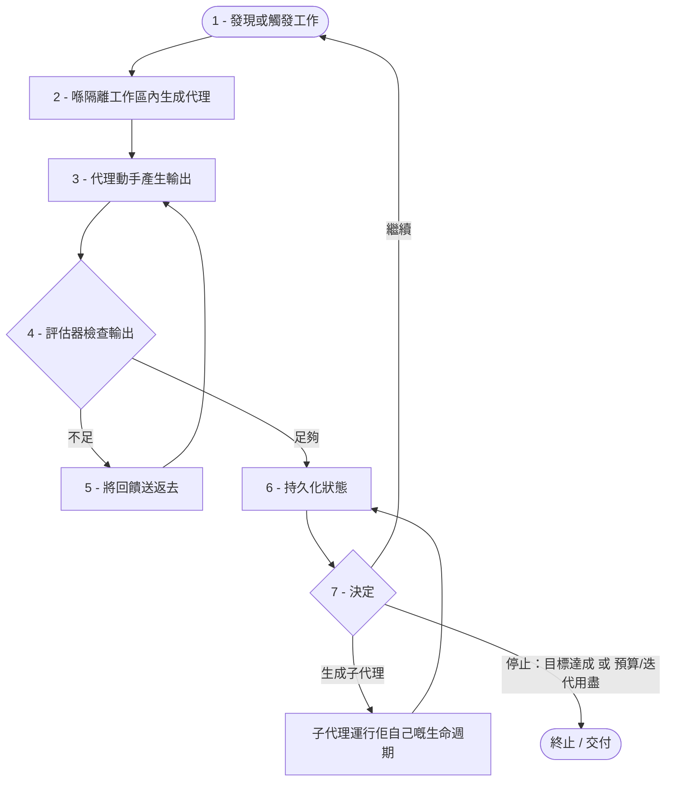

# 07. 迴圈生命週期（Loop Lifecycle）

> **本章內容：** 你會學到第 06 章所講的八個組件，如何化作一個有次序、會重複的
> **生命週期（lifecycle）**——即係一個工作單元喺迴圈（Loop）運行時所經歷嘅七個
> 階段：發現或觸發工作、喺一個隔離工作區（isolated workspace）內生成代理
> （spawn agents）、動手產生輸出、評估該輸出、當輸出未達標就將回饋送返去並重試、
> 持久化狀態，然後再決定係繼續、生成子代理（sub-agent），定係停止。你會學到驅動
> 最後呢個三選一決定嘅準則，亦會見到成個流程以圖表、編號序列同一段圍欄式
> （fenced）偽代碼三種方式呈現出嚟。睇完之後，你就能夠由觸發追蹤一件工作直到
> 終止，並且解釋喺每個階段發生咩事——同埋點解會咁。

## 由零件到運轉

第 06 章打開咗部機器，講出佢嘅八個零件。本章就令呢啲零件郁起嚟。一張組件清單
話畀你知迴圈係由*乜嘢*組成；而生命週期就話畀你知*呢啲零件隨住時間點樣互動*
——控制權由一個傳去下一個嘅次序，以及每個零件喺繞圈每一次所貢獻嘅嘢。

生命週期係一條簡單問題嘅答案：*當一個迴圈運行嗰陣，逐步逐步究竟發生咩事？*
喺人手提示（manual prompting）嘅時候，呢個序列係你自己提供——你判斷有工作要做、
你叫代理去做、你睇結果、你判斷好唔好、你記住自己做到邊、你再決定要唔要再問一次。
迴圈就將呢個完全一樣嘅序列編碼成一個會重複嘅循環，等佢可以喺你唔坐喺度嗰陣都運行
到。下面嘅階段，正正就係嗰啲同樣嘅判斷，只係明明白白咁列出嚟並排好次序。

## 七個階段

迴圈會將工作經由**七個有次序嘅階段**推進。第一至第六階段構成單次迭代
（iteration）嘅主體；第七階段就係結束該次迭代並選擇下一步嘅決定。每個階段都由
你喺第 06 章認識嘅一個或多個組件所掌管，我哋會一路用**粗體**標示出嚟。

### 階段 1 — 發現或觸發工作

循環喺工作*進入*迴圈嗰一刻開始。要麼迴圈發現有嘢要做——清單上下一件未完成嘅
項目——要麼有外部事件去觸發佢。呢個係**自動化／觸發器（Automation/Trigger）**
組件嘅職責：一個喺通宵啟動嘅 cron 排程、一個喺新提交議題（issue）上嘅 webhook，
又或者一個 `/loop` 式嘅指令。喺呢個階段開始迭代之前乜都唔會發生，而呢度亦唔需要
有人手動打「開始」。

### 階段 2 — 喺隔離工作區內生成代理

有咗工作之後，迴圈會為呢件工作開闢一個乾淨、封閉嘅地方，並喺裏面啟動一個或多個
代理。呢個階段運用咗**工作樹／隔離（Worktrees/Isolation）**——一個 git 工作樹
同一條專屬分支——令到代理無論做咩都受到包圍而且可以回復。被生成嘅代理就係
**生成器代理（Generator Agent，負責產生輸出嘅代理）**，而佢一啟動就會獲交付項目嘅
**技能／知識（Skills/Knowledge）**（即係編碼規範同代理指引檔案），令佢由第一個動作
開始就跟你嘅規則辦事。

### 階段 3 — 代理動手產生輸出

喺佢嘅隔離工作區裏面，**生成器代理**做實際嘅工作：閱讀任務、編輯代碼庫、產生一個
差異（diff）。當佢需要接觸外部世界——由源碼管理主機讀取代碼、由議題追蹤系統抽取
細節——佢就會經由**連接器（Connectors）**去做。呢個階段係唯一一個*創造*新輸出嘅
階段；其餘每個階段嘅存在，都係為咗啟動佢、檢查佢、記住佢，或者決定點樣處理佢。

### 階段 4 — 評估器檢查輸出

啱啱產生嘅輸出，依家會由外部去判斷。**評估器（Evaluator，即評審／驗證者）**會
運行測試套件、審查差異，又或者按一份評分準則（rubric）去評分，並交回一個裁決：
呢樣夠唔夠好？呢個階段保護迴圈，唔好自信滿滿咁接受咗錯誤或低質素嘅工作。最緊要嘅
係，評審者係同工作者*分開*嘅——生成器代理唔可以自己批改自己份功課。

### 階段 5 — 若不足，將回饋送返去並重試

如果評估器嘅裁決係「唔夠好」，迴圈唔會將件工作丟棄——佢會*由失敗中學習*。出咗
咩錯嘅具體訊號（失敗嘅測試輸出、審查者嘅評語、評分準則嘅低分備註）會作為附加脈絡
（context）送返畀**生成器代理**，然後循環返去階段 3 再試多次。呢條回饋路徑正正
就係令一個迴圈成為*迴圈*嘅核心：每一次被拒絕嘅嘗試都令下一次嘗試掌握更多資訊，
而唔係盲目重複。（呢個階段係有條件嘅——當輸出已經足夠，迴圈就直接跳過佢。）

### 階段 6 — 持久化狀態

無論今次迭代係成功咗、定係只係取得部分進展，迴圈都會用**狀態／記憶
（State/Memory）**組件，將發生嘅嘢記錄喺任何單一代理嘅脈絡*之外*：佢會更新
`TODO.md`、喺草稿板（scratchpad）寫筆記，又或者喺項目看板（project board）上面移動
一張卡。呢樣就令下一次迭代可以建基於今次之上，而唔使由零開始——亦令*你*可以隨時
讀到工作嘅當前狀態。

### 階段 7 — 決定：繼續、生成子代理，定係停止

當迭代完成並且狀態已經保存好，迴圈就去到佢嘅決定點。主要由**停止條件
（Stopping Condition）**指引之下，佢會喺三條路之中揀一條：**繼續**做多一次迭代、
**生成一個子代理（spawn a sub-agent）**去處理一件獨立嘅工作，又或者**停止**。
呢個三選一嘅選擇咁緊要，所以下一節會全部用嚟講佢。

## 決定點：繼續、生成，定係停止

每一次繞迴圈一圈，最後都會去到同一個分岔口，而佢揀邊條路係由清晰嘅準則去決定，
而唔係靠估。**停止條件**喺呢度係主要權威，不過呢個決定真係三選一嘅。

**停止** — 當以下兩種規則其中一種觸發時，迴圈就會終止：

- *成功。* 目標已達成：評估器嘅測試通過咗，又或者評分準則嘅分數已到達門檻。工作
  已經做完，所以迴圈會刻意收結並交付佢嘅結果（例如，經由一個**連接器**開一個拉取
  請求／pull request）。
- *安全。* 觸碰咗一條護欄（guardrail）：到達咗最大迭代次數，又或者用盡咗代幣／成本
  預算（token/cost budget）。喺呢度迴圈係*未*成功就停低，並且升級交畀人處理，而唔係
  繼續空轉。呢條規則正正係防止迴圈變成一個失控進程嘅關鍵。

**繼續** — 如果成功同安全嘅規則都未觸發，咁就仲有有用嘅工作要做、亦仲有預算去做，
所以迴圈會再繞多一圈。實際上「繼續」係階段 5 嘅回饋之後所行嘅路：當前任務未完成、
嘗試次數同預算都仲喺界限之內，於是迴圈就帶住佢啱啱學到嘅嘢，喺同一個任務上開始一次
全新嘅迭代。

**生成一個子代理** — 有時候正確嘅做法既唔係重試同一個任務，亦唔係收手，而係
*委派（delegate）*。當工作自然咁分裂成一件獨立、自成一體嘅部分——一個夠大、值得擁有
自己嘅隔離工作區同自己嘅評估嘅聚焦子任務（sub-task）——迴圈就會生成一個子代理去處理
佢。呢個子代理會運行佢自己嘅微型生命週期（佢自己嘅生成、動作、評估、持久化），並將
佢嘅結果報告返畀母迴圈。傾向於生成子代理嘅準則係*可分解性（decomposability）*（任務
可以乾淨咁劃分）同*獨立性（independence）*（嗰一部分可以喺唔使不斷協調之下進行）；
當一個代理線性咁慢慢磨會比起將工作分派出去更慢或者更亂嗰陣，就揀呢條路。

簡而言之：做完咗或者用盡預算就**停止**，當工作應該被劃分同委派就**生成一個子代理**，
而當手上嘅任務仲有嘢要做、亦有資源繼續落去嗰陣就**繼續**。

## 生命週期，視覺化

同一個流程喺下面以三種方式呈現——圖表、編號序列同偽代碼——等你可以用對你嚟講
最清楚嗰種方式去讀。



以編號流程嚟讀，同一個生命週期係咁樣嘅：

1. **發現或觸發工作** — 自動化／觸發器啟動一次迭代。
2. **喺隔離工作區內生成代理** — 工作樹／隔離畀生成器代理一個安全嘅地方去運行，
   並載入技能／知識。
3. **代理動手產生輸出** — 生成器代理編輯代碼，按需要經由連接器伸手向外。
4. **評估器檢查輸出** — 測試、審查，或者一份評分準則交回一個裁決。
5. **若不足，將回饋送返去並重試** — 失敗訊號送返畀代理，控制權返去步驟 3。
6. **持久化狀態** — 狀態／記憶記錄進度，等下一次迭代建基於今次之上。
7. **決定：繼續、生成一個子代理，定係停止** — 停止條件揀路；*繼續*返去步驟 1、
   *生成*委派一個子任務、*停止*喺成功或者喺安全限制下終止。

而以偽代碼表達，生命週期就係一個內裏嵌套住一條回饋路徑嘅迴圈：

```python
# 迴圈生命週期作為一個控制迴圈。階段以編號對應正文。
def run_loop(goal, max_iterations, budget):
    state = load_state()                          # 狀態／記憶跨次運行持久化

    while True:
        task = discover_or_trigger_work(state)    # 1：自動化／觸發器
        if task is None:
            stop("no work left")                  # 冇嘢做 -> 終止

        workspace = spawn_isolated_workspace(task)  # 2：工作樹／隔離
        agent = spawn_generator_agent(workspace, skills)  # 2：生成器 + 技能

        feedback = None
        while True:
            output = agent.act(task, feedback)    # 3：生成器代理產生輸出
            verdict = evaluator.check(output)     # 4：評估器由外部判斷
            if verdict.is_sufficient:
                break                             # 接受 -> 離開內層迴圈
            feedback = verdict.details            # 5：將失敗訊號送返去
            if over_budget(budget) or hit_iteration_cap(max_iterations):
                stop("safety limit reached -> escalate to a human")

        state = persist_state(state, task, output)  # 6：狀態／記憶

        decision = decide(state, goal, budget, max_iterations)  # 7：停止條件
        if decision == "stop":
            stop("goal met" if goal_met(state) else "budget/iterations exhausted")
        elif decision == "spawn_sub_agent":
            subtask = next_decomposable_piece(state)
            run_loop(subtask, max_iterations, budget)  # 子代理：佢自己嘅生命週期
        # 否則："continue" -> 落去並開始下一次迭代
```

呢段偽代碼令兩個結構上嘅要點顯而易見。第一，其實有*兩個*迴圈：一個**內層**迴圈
（階段 3–5），喺度單一任務會帶住回饋不斷重試，直到評估器接受佢或者觸發一條安全
限制為止；以及一個**外層**迴圈（階段 1–7），由一個工作單元推進去下一個。第二，
階段 7 嗰個 `decide(...)` 調用正正係**停止條件**所在嘅地方——佢係唯一一個揀繼續、
生成定停止嘅地方，亦係令成個結構會終止而唔係永遠運行落去嘅原因。

## 生命週期點樣運用八個組件

生命週期唔係一個額外加裝喺組件之上嘅分開機制——佢*就係*呢啲組件，只係喺運轉之中
被觀察到。每個階段不過係某個特定組件做佢份工嘅嗰一刻：

| 生命週期階段 | 負責做嘢嘅組件 |
|-----------------|-----------------------------|
| 1. 發現或觸發工作 | 自動化／觸發器 |
| 2. 喺隔離中生成代理 | 工作樹／隔離、生成器代理、技能／知識 |
| 3. 代理動手產生輸出 | 生成器代理、連接器 |
| 4. 評估器檢查輸出 | 評估器 |
| 5. 將回饋送返去並重試 | 評估器 → 生成器代理 |
| 6. 持久化狀態 | 狀態／記憶 |
| 7. 決定：繼續、生成，定係停止 | 停止條件（交付時連同連接器） |

由上到下讀呢張表，你就追蹤咗一個工作單元——由准許佢入嚟嘅觸發，去到放佢出去嘅
決定——正正就係第 06 章講「八個零件『追蹤單一工作單元行經迴圈嘅路徑』」嗰陣所預告
嘅同一段旅程。組件係名詞；生命週期係動詞。兩樣都喺手，你就準備好迎接第 08 章，
喺嗰度你會建立一個真係會運行呢個循環嘅迴圈——由一個極簡版本開始，再演化成一個
生產級（production-grade）系統。

## 重點摘要

- 一個迴圈以一個有次序、會重複嘅**七階段生命週期**運行：(1) 發現或觸發工作、
  (2) 喺隔離工作區內生成代理、(3) 代理動手產生輸出、(4) 評估器檢查輸出、(5) 若不足，
  將回饋送返去並重試、(6) 持久化狀態，以及 (7) 決定係繼續、生成一個子代理，定係停止。
- 階段 3–5 構成一個**內層回饋迴圈**：被拒絕嘅嘗試唔會被丟棄，而係作為附加脈絡送返畀
  生成器代理，等每次重試都比上一次掌握更多資訊。
- 階段 7 嘅**決定點**係三選一嘅。喺成功（測試通過、達到評分準則門檻）或者喺安全限制
  （用盡最大迭代次數或預算，升級交畀人）之下就**停止**。當任務未完成而資源仲在時就
  **繼續**。當工作夠可分解又夠獨立、足以作為佢自己嘅迷你生命週期去委派嗰陣，就
  **生成一個子代理**。
- **停止條件**係決定點上唯一嘅權威——佢就係保證迴圈刻意終止、而唔係永遠運行落去嘅
  嘢。
- 每個生命週期階段不過係**第 06 章嗰八個組件**之中其中一個喺做佢份工：組件係零件，
  而生命週期就係呢啲零件喺運轉之中。

---
[< 上一章：迴圈的解剖：組件](06-anatomy-of-a-loop_hk.md) | [目錄](README_hk.md) | [下一章：建立一個迴圈：實務指南 >](08-building-a-loop_hk.md)
